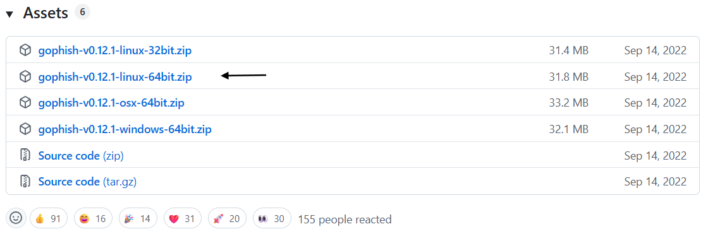

# Install & Run Run GoPhish Phishing Framework

## **Overview**

GoPhish is an open-source phishing framework used by security professionals to simulate phishing attacks and test employee awareness. This lab covers the installation and initial setup of GoPhish on Linux.

**Category:** Social Engineering / Red Team  
**Tools:** GoPhish, Linux, CLI  
**OS:** Kali Linux

---

## **What is GoPhish?**

GoPhish is a phishing simulation tool that allows security teams to:
- Create and send phishing emails
- Track who clicks malicious links
- Measure security awareness across an organization
- Generate reports on phishing campaign results

---

## Step 1: Download GoPhish

To install GoPhish we will access the next link: ‣[https://github.com/gophish/gophish/releases](https://github.com/gophish/gophish/releases)

We go to the bottom of the page and download the selected file:

## Step 2: Extract the Files

Extract the downloaded archive into your working directory:

## Step 3: Set Execute Permissions

By default the GoPhish binary doesn't have execute permissions.

We access the folder:

To execute the program, we need to change the permissions to be able to execute the file with `chmod`

After giving the permissions we will execute te gophish file: 

**IMPORTANT INFORMATION AFTER THE EXECUTION:**

- USER AND PASSWORD
- IP TO ACCESS THE WEB

## Step 4: Run GoPhish

To access the portal [https://127.0.0.1:3333](https://127.0.0.1:3333) and click advanced options and accept the risk and continue:

Once we are in the login portal we are going to use the user and password provided:

We change the password: 

We access the portal

## Key Takeaways

- GoPhish is a powerful tool for authorized phishing simulations
- It should only be used in controlled environments with explicit permission
- Real-world use cases include security awareness training and penetration testing engagements

---

## ⚠️ Legal Disclaimer

This lab was conducted in a controlled environment for educational purposes only.
Unauthorized phishing attacks are illegal and unethical.